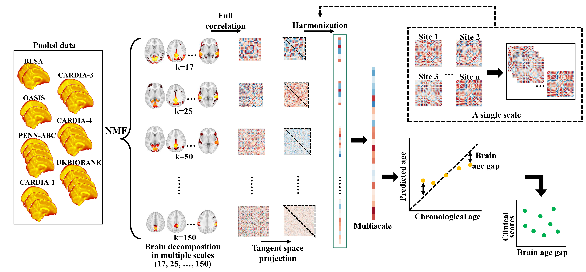

# Mutliscale brain aging patterns
 
This repository contains the codes and example data underlying our recent paper:

[Zhou, Zhen, et al. "Multiscale functional connectivity patterns of the aging brain learned from harmonized rsfMRI data of the multi-cohort iSTAGING study." NeuroImage (2023): 119911.](https://www.sciencedirect.com/science/article/pii/S1053811923000599)

[Zhou, Zhen, et al. "Harmonization of multi-site functional connectivity measures in tangent space improves brain age prediction." Medical Imaging 2022: Biomedical Applications in Molecular, Structural, and Functional Imaging. Vol. 12036. SPIE, 2022.](https://www.spiedigitallibrary.org/conference-proceedings-of-spie/12036/1203608/Harmonization-of-multi-site-functional-connectivity-measures-in-tangent-space/10.1117/12.2611557.full)

# When you encounter issues
This code was written by a single person as a research project.

I am currently still in the process of setting-up / testing this repository and adding more comments here. If you encounter any bugs, please open a respective GitHub Issue; I will try my best to fix them in time!